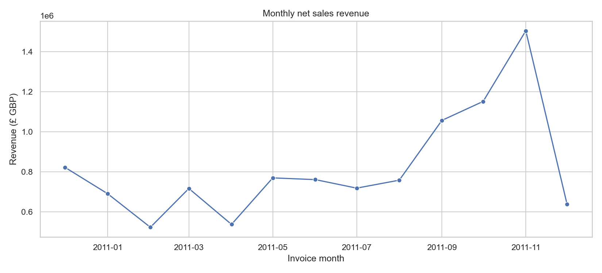
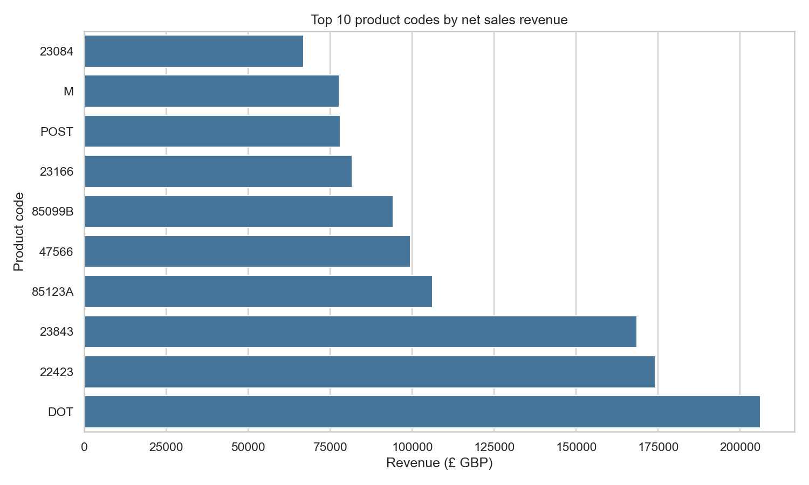
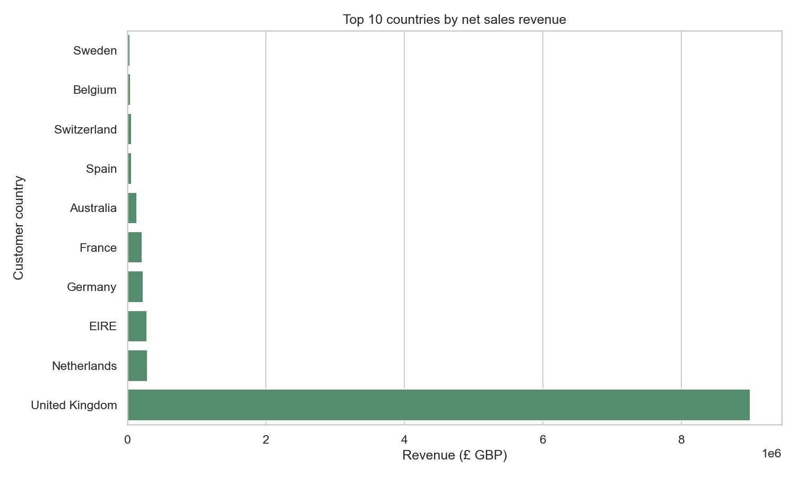

# E-Commerce Sales & Customer Analytics

An end-to-end analytics project using the UCI Online Retail transaction dataset. A reproducible Python pipeline cleans and audits invoice lines, calculates sales and customer metrics, and exports tables for PostgreSQL analysis and Power BI import. Metric definitions and data limitations are documented alongside the results.

**Stack:** Python · pandas · NumPy · PostgreSQL · SQL · Jupyter · pytest

## Key Findings

Results below come from the implemented definitions and the full 541,909-row source workbook. Net revenue includes eligible negative-quantity returns; orders and customer purchase counts require positive-quantity, positive-price, non-cancelled lines.

- **£10,642,110.80** eligible net sales across **19,960** positive-purchase invoices.
- **£533.17** mean net average order value; median invoice net revenue is **£303.30**.
- **4,338** identified purchasing customers; **2,845** have at least two distinct positive-purchase invoices (**65.58%** of identified purchasers).
- The United Kingdom accounts for **£9,001,744.09** (**84.59%**) of eligible net sales.
- November 2011 has the highest observed monthly net revenue (**£1,503,866.78**); February 2011 the lowest (**£522,545.56**). This one-year historical sample does not establish seasonality.

Revenue is sales revenue, not profit. Customer counts exclude rows without a customer ID. See [metric definitions and limitations](#limitations) before interpreting these results.

## Project Architecture

```text
UCI Online Retail workbook
          │
          ▼
Python cleaning, quality audit, and feature engineering
          │
          ├──► Analysis summary and charts
          ├──► Power BI-ready CSV tables
          └──► PostgreSQL star schema ──► analytical SQL queries
```

## Skills Demonstrated

- Data cleaning, type conversion, identifier normalization, duplicate handling, and missing-value analysis
- Reproducible data pipelines and data quality reporting
- Business metric design for net revenue, order value, repeat purchasing, product, country, and RFM summaries
- Relational modeling with a PostgreSQL fact table and dimensions
- SQL aggregation, filtered counts, CTEs, joins, and window functions
- Focused Python tests and SQL syntax validation
- Communicating metric assumptions and dataset limitations

## Technical Implementation

- `src/` downloads, cleans, engineers, analyzes, and optionally loads the data into PostgreSQL.
- `sql/` defines the star schema, quality checks, and analytical queries. SQL purchase counts follow the Python rule: identified purchasers must have at least one eligible positive-quantity purchase. Net revenue includes eligible returns as negative amounts.
- `notebooks/` contains data exploration and business analysis.
- `tests/` covers cleaning, feature engineering, analysis metric definitions, and PostgreSQL SQL parsing with `pglast`.
- `.github/workflows/quality.yml` runs pytest, including SQL parsing, on pushes and pull requests. It does not require a live PostgreSQL server.
- `dashboard/README.md` specifies proposed Power BI pages, measures, visuals, and filters. **No `.pbix` file is included and no Power BI dashboard is claimed.**

### Example analysis charts

These are actual charts generated by the project pipeline from the source dataset.







## Dataset and Method

- **Dataset:** [UCI Online Retail, dataset 352](https://archive.ics.uci.edu/dataset/352/online+retail), DOI [10.24432/C5BW33](https://doi.org/10.24432/C5BW33)
- **Attribution:** Chen, D. (2012). *Online Retail* [Dataset]. UCI Machine Learning Repository.
- **License:** CC BY 4.0 for the dataset. The raw workbook is downloaded locally and is not committed.
- **Source period:** 2010-12-01 through 2011-12-09; one UK-based retailer.

Exact duplicate rows are removed. Cancellation lines, returns, and nonpositive prices remain in the cleaned fact table with explicit flags. Revenue sums quantity × unit price for non-cancelled lines with nonzero quantity and positive price, so eligible returns reduce net revenue. Positive-purchase orders require a positive quantity and positive price. Repeat customers are identified customers with at least two distinct positive-purchase invoices. RFM is retrospective and descriptive, not a prediction.

## Limitations

- The data represents one historical retailer and is not a current or representative e-commerce market sample.
- Customer IDs are missing on some lines, limiting customer attribution.
- The dataset has no cost or reviewed product category/type fields; profit, margin, and category performance cannot be calculated. Product-code rankings can include postage and service adjustments.
- The period is about one year and starts and ends with partial December data; monthly changes do not establish seasonality or cause.
- There is no live PostgreSQL integration test, and no `.pbix` dashboard has been built. SQL scripts are syntax-parsed in the test suite.

## Run Locally

Python 3.9 or newer is required. PostgreSQL is optional for the Python analysis; it is needed only to load and query the relational model.

```bash
python3 -m venv .venv
source .venv/bin/activate
python -m pip install -r requirements.txt
python -m src.download_data
python -m src.pipeline
python -m pytest
```

The pipeline writes quality and analysis JSON reports, four charts in `reports/figures/`, and Power BI-ready CSV tables in `data/processed/`. Generated CSVs are ignored by Git; the three small chart images shown above are tracked for repository preview. Explore the notebooks with `jupyter lab`.

To load CSVs into a **dedicated** PostgreSQL database, set `DATABASE_URL` and run `python -m src.load_postgres`. This rebuilds tables in the `retail_analytics` schema. Then execute the scripts in `sql/` using `psql` or a PostgreSQL client.

## Repository Structure

```text
dashboard/   Power BI report specification
docs/        Cleaning and metric methodology
notebooks/   Exploration and analysis notebooks
reports/     Tracked summary reports and preview charts
sql/         PostgreSQL schema, checks, and analytical queries
src/         Data pipeline and optional PostgreSQL loader
tests/       Python behavior and SQL syntax tests
```

Code is licensed under MIT (see [LICENSE](LICENSE)). The dataset has its own CC BY 4.0 license and attribution requirements.
